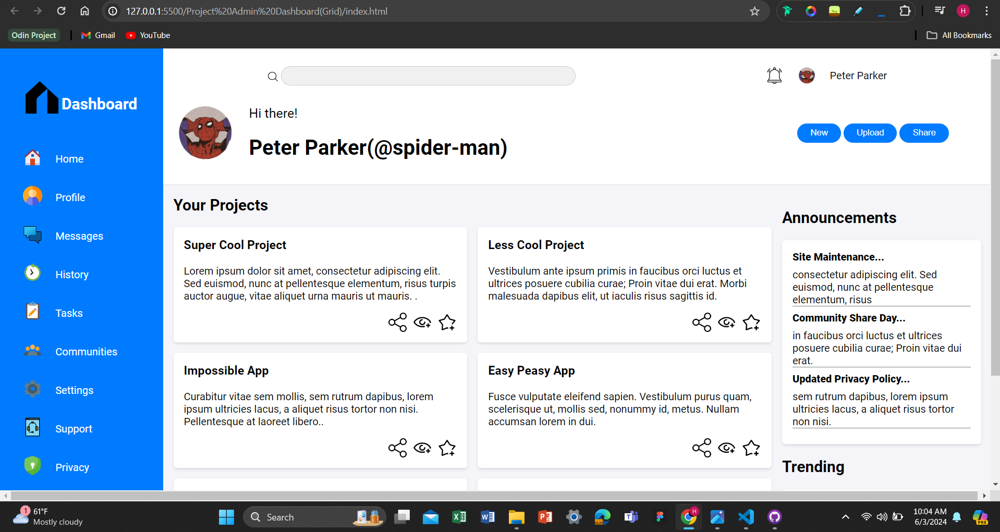

# Dashboard Project

## Overview

This project is a web-based dashboard layout built using HTML and CSS. The dashboard utilizes CSS Grid for the overall layout structure and Flexbox for specific components to ensure a responsive and flexible design. The design includes a sidebar, header, main content area, and additional sections for announcements and trending topics.

## Features

- **Responsive Layout**: The dashboard adjusts to different screen sizes.
- **Sidebar Navigation**: Contains links to different sections of the dashboard.
- **Main Header**: Displays user information and main actions (New, Upload, Share).
- **Projects Section**: Showcases user projects with icons for interaction.
- **Announcements and Trending Sections**: Provide updates and trending topics.

## Layout

The dashboard layout is divided into a sidebar, header, and main content area using CSS Grid, while Flexbox is used for aligning items within these sections.

## Preview



## File Structure

- `index.html`: Contains the HTML structure of the dashboard.
- `styles.css`: Contains the CSS styles for the dashboard.

## CSS Grid Structure

The main layout is defined using CSS Grid, which ensures a responsive and adaptable design.

## Flexbox Usage

Flexbox is used within sections for aligning items:

- **Sidebar Navigation**: Uses Flexbox to align items vertically.
- **Header**: Uses Flexbox to space out search, notifications, and user information.

## Installation

1. Clone the repository:
    ```bash
    git clone https://github.com/Lati-byte/Admin-Dashboard.git
    ```
2. Open `index.html` in a web browser to view the dashboard.

## Contributing

Feel free to submit issues, fork the repository and send pull requests. For major changes, please open an issue first to discuss what you would like to change.

## License

This project is licensed under the MIT License.

---

This README provides a concise and clear overview of your dashboard project, detailing its features, layout, and instructions for installation.
